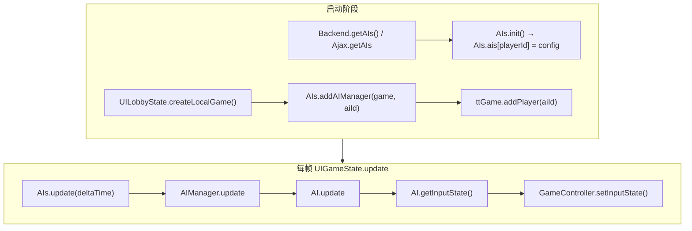
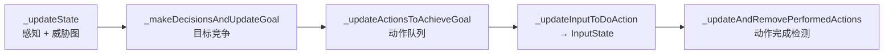
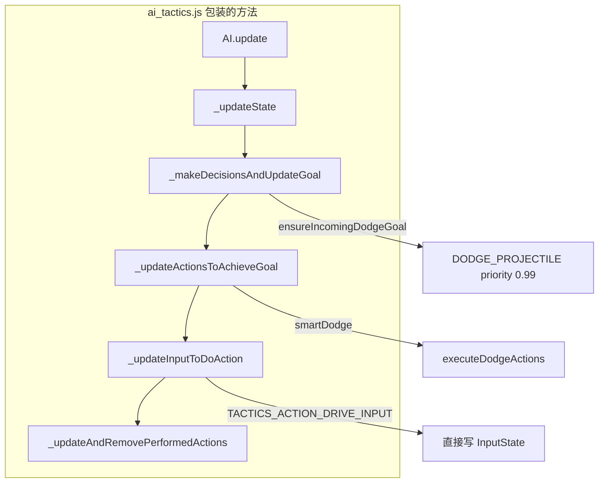

# Tank Trouble AI 原理

本文基于客户端源码 `RELEASE-2026-05-11-01` 逆向整理，主要参考 `game_core/original_js/` 中的可读合并文件。

| 模块文件 | 职责 |
|----------|------|
| `ais.js` | 全局 AI 注册表、分配 AI 实例 |
| `aimanager.js` | 单个 AI 与 `GameController` 的桥接 |
| `ai.js` | 决策、寻路、威胁评估、输入生成 |
| `aiutils.js` | 弹道检测、躲避、驾驶/转向/开火输入 |
| `mazemap.js` | 迷宫最短路径、逃离路径、威胁加权寻路 |
| `b2dutils.js` | Box2D 弹道模拟、墙体碰撞 |

---

## 1. 总体架构

AI 在客户端完全本地运行：每帧读取对局状态，输出与真人相同的 `InputState`（前进/后退/左转/右转/开火），经 `GameController.setInputState` 注入物理引擎。



### 1.1 `AIs`（全局管理器）

- **`AIs.ais`**：`playerId → config` 的性格配置表，由 `getAIs` 接口填充。
- **`AIs.aiManagers`**：当前活跃对局中每个 AI 一个 `AIManager`。
- **`AIs.aisInUse[gameId]`**：某局已占用的 AI id，避免同一 AI 重复加入。
- **`AIs.init()`**：启动时异步拉取 AI 列表；`AIs.isReady()` 为 true 后才能在本地局中加入 AI。
- **`AIs.getAvailableAIId(gameId)`**：返回尚未被该局占用的 AI id。
- **`AIs.addAIManager(gameController, aiId)`**：创建 `AIManager` 并登记占用。
- **`AIs.update(deltaTime)`**：遍历所有 `AIManager` 更新。

### 1.2 `AIManager`（桥接层）

每个 AI 玩家对应一个 `AIManager`：

1. 持有 `AI.create(aiId, config, gameController)` 实例。
2. 每帧调用 `ai.update(deltaTime)`。
3. 对比上一帧输入，若 `forward/back/left/right/fire` 任一变化，则 `gameController.setInputState(newInputState)`。
4. 避免每帧重复提交相同输入，减少网络/本地同步开销。

### 1.3 `AI`（决策核心）

单 tank 的「大脑」，维护世界模型、当前目标、动作队列，最终生成 `InputState`。

---

## 2. 接入对局的流程

### 2.1 原版 `createLocalGame`

`Game.UILobbyState.createLocalGame`（`uimenustate.js` / `uilobbystate.js`）逻辑：

1. `Constants.setMode(MODE_CLIENT_LOCAL)`
2. `GameController.create(BootCampGameMode, …)` 创建本地局
3. 把 `Users.getAllPlayerIds()` 中所有玩家 `addPlayer`
4. **若只有 1 名玩家** 且 `AIs.isReady()`：
   - `aiId = AIs.getAvailableAIId(gameId)`
   - `AIs.addAIManager(ttGame, aiId)`
   - `ttGame.addPlayer(aiId)`
5. `state.start('Game', …, ttGame)` 进入对局

### 2.2 本地补丁增强

`game_core/js/local_patch.js` 在 Ajax 层 mock `getAIs`，并 patch `createLocalGame`：

- 即使 `AIs.isReady()` 因网络失败为 false，也会 `ensureAIsReady()` 注入 Laika / Dimitri 配置。
- 单人局强制加 AI；`getAvailableAIId` 失败时回退到 `getAllAIIds()[0]`。

内置两名 AI（与 CDN 一致）：

| 名称 | playerId | aggressiveness | cleverness | boldness | greediness | dexterity | determination | vengefulness |
|------|----------|----------------|------------|----------|------------|-----------|---------------|--------------|
| Laika | 6148530 | 0.9 | 0.4 | 0.9 | 0.2 | 0.6 | 0.6 | 0.8 |
| Dimitri | 6148531 | 0.7 | 0.7 | 0.5 | 0.4 | 0.5 | 0.7 | 0.5 |

**直观差异：** Laika 更激进、更大胆、更记仇，但「聪明」较低；Dimitri 更均衡、更聪明，攻击性略低。

---

## 3. 每帧更新流水线

`AI.update(deltaTime)` 固定四步：



### 3.1 感知（`_updateState`）

将连续坐标离散为 **迷宫格坐标**（`floor(x / MAZE_TILE_SIZE)`），并收集：

| 数据 | 用途 |
|------|------|
| 所有 tank 位置 | 追击、威胁、目标选择 |
| 武器箱 / 护盾箱 / 金币 / 钻石 | 拾取目标 |
| 飞行子弹路径（Box2D 模拟） | 躲避、威胁图 |
| 地雷 / 陷阱 | 威胁图 |
| 敌人瞄准线 / 激光瞄准器 | 躲避、威胁 |
| 出生区 / 风暴区 | 威胁加权 |

**威胁图 `threatMap`**：与迷宫同尺寸的 `MazeMap`，累加各类危险权重。后续寻路用 `getShortestPathWithGraph(..., threatMap, weight)` 或 `getPathAwayFromWithThreats` 绕开高危区域。

威胁相关参数大多随 **`cleverness`** 在 min/max 间插值，例如：

- 考虑子弹的距离、模拟反弹次数、路径长度
- 敌人「可能开火路径」的反弹次数与长度
- 地雷随存在时间衰减的威胁权重

**动态性格变量：**

- **`currentAggressiveness`**：从 0 随时间向 `config.aggressiveness` 增长；开火/埋雷/反击后会 `shrinkage` 降低。
- **`currentGreediness`**：同理向 `config.greediness` 增长；拾取物资后降低。

**卡墙检测：** 监听 `TANK_MAZE_COLLISION`，记录碰撞法线；`stuckTime` 超阈值时提高 `GET_UNSTUCK` 目标优先级。

**击杀记忆：** 监听 `TANK_KILLED`，保留最近 `Constants.AI.KILLS_TO_REMEMBER`（10）条，供复仇目标计算。

---

## 4. 性格维度（Traits）

配置中每条 trait 为 **0.0～1.0 的字符串或数值**，通过 `MathUtils.linearInterpolation(min, max, trait)` 映射到具体行为参数。

| Trait | 键名 | 主要影响 |
|-------|------|----------|
| **aggressiveness** | 攻击性 | 追击/开火意愿、弹道扫描扇形宽度、开火距离阈值、埋雷优先级；随时间回升 |
| **vengefulness** | 复仇心 | 被某玩家击杀次数越多，越优先以该玩家为 `preferredTarget` |
| **cleverness** | 聪明 | 威胁感知范围、弹道/瞄准模拟精度、目标切换周期、拾箱距离、Preferred 目标权重 |
| **greediness** | 贪婪 | 拾取金币/钻石/武器箱的优先级与搜索距离；随时间回升 |
| **boldness** | 胆量 | 躲避距离阈值（低=更早跑）、威胁图权重（高=更不怕危险区）、逃跑优先级 |
| **determination** | 专注 | 当前目标 priority 衰减速度（高=更不换目标） |
| **dexterity** | 灵巧 | 转向误差、反应延迟、开火延迟（高=更准更快） |
| **insanity** | — | 配置字段存在，**当前 `ai.js` 逻辑中未使用** |
| **chattiness** | — | 配置字段存在，**当前 `ai.js` 逻辑中未使用**（聊天可能在其他模块） |

插值公式（源码惯例）：

```javascript
value = min + (max - min) * config[trait]
// 或 randomAroundZero(linearInterpolation(maxImprecision, 0, dexterity))
```

---

## 5. 目标系统（Goals）

AI 采用 **优先级竞争**：每帧生成多个「候选目标」，`_updateGoal` 仅当 `new.priority > current.priority` 时替换。当前目标有 **`period`**（持续思考时间），未到期则不再重新决策。

### 5.1 目标类型

| 目标 | 含义 | 典型 priority 来源 |
|------|------|-------------------|
| `DODGE_PROJECTILE` | 躲子弹 | 与子弹最近距离、boldness |
| `SHOOT_AFTER` | 主动射击 | 与敌人距离、aggressiveness、preferredTarget |
| `LAY_TRAP` | 埋地雷 | 死胡同程度、aggressiveness、与已有地雷距离 |
| `RUN_AWAY` | 逃跑 | 弹尽/被瞄准/全员护盾等；boldness 调节 |
| `PICK_UP_COLLECTIBLE` | 捡箱子/金币/钻石 | 距离、greediness、cleverness |
| `HUNT` | 追击敌人 | 距离、cleverness、`MAX_HUNT_PRIORITY` |
| `GET_UNSTUCK` | 脱困 | `stuckTime / MAX_STUCK_TIME` |
| `IDLE` | 闲逛 | 固定低优先级 `IDLE_PRIORITY` (0.01) |

### 5.2 首选攻击对象（`_getPreferredTarget`）

1. **复仇**：统计近期击杀自己的玩家次数，按 `vengefulness` 计算 `revengePriority`。
2. **制胜**（Deathmatch）：优先攻击击杀数最高的玩家，权重随 `cleverness`。
3. 结果供 `SHOOT_AFTER` / `HUNT` 增加 `targetPriorityOffset`。

### 5.3 决策顺序（`_makeDecisionsAndUpdateGoal` 概要）

1. 若当前目标 `period > 0`，仅倒计时，**不重新决策**。
2. 否则按 `determination` 衰减当前目标 priority。
3. 依次评估并 `_updateGoal`：
   - 武器箱 / 护盾箱（武器队列未满时）
   - 金币 / 钻石（随 `currentGreediness`）
   - 每条子弹轨迹 → `DODGE_PROJECTILE`（有护盾则跳过）
   - 当前武器允许开火 → `SHOOT_AFTER`
   - 地雷武器 → `LAY_TRAP`
   - 默认武器打空 / 被激光瞄准 / 全员护盾 → `RUN_AWAY`
   - 卡墙 → `GET_UNSTUCK`
   - 每个非护盾敌人 → `HUNT`
   - 兜底 → `IDLE`

目标切换时返回 `true`，触发 `_updateActionsToAchieveGoal` 重建动作队列。

---

## 6. 动作系统（Actions）

目标确定后，`_updateActionsToAchieveGoal` 清空 `actions[]`，压入一串原子动作：

| 动作 | 行为 |
|------|------|
| `DRIVE_TO_TILE` | 开到指定迷宫格中心 |
| `DRIVE_TO_POSITION` | 开到世界坐标（可倒车 `canReverse`） |
| `TURN_TO` | 炮口转向某方向（带 `imprecision` 误差） |
| `FIRE` | 开火（`delay` 反应延迟 + `duration` 连发时长） |
| `IDLE` | 原地等待随机时长 |

`_updateInputToDoAction` 只执行 **`actions[0]`**，将其转为 `InputState`：

- 驾驶 → `AIUtils.getInputToDriveToPosition`
- 转向 → `AIUtils.getInputToTurnToDirection`
- 开火 → `AIUtils.getInputToFire`

`_updateAndRemovePerformedActions` 检测到达格点/转向完成/延迟结束，弹出已完成动作。

### 6.1 射击决策要点（`SHOOT_AFTER`）

1. 若炮口与目标 **直线无墙** → `TURN_TO` + `FIRE`。
2. 否则在 ± 扇形内扫描多条 `AIUtils.checkFiringPath`：
   - 结果：`HIT` / `NEAR` / `MISS` / `SUICIDE`（会误伤自己）
   - 选最短路径或最近距；优先 `preferredTarget`
   - 仅当 `closestDistance < distanceToFire(aggressiveness)` 才真正 `FIRE`
3. 躲避/逃跑过程中可 `_tryToRetaliate`：若反击路径 `HIT` 或足够 `NEAR`，插入延迟开火。

### 6.2 寻路

- **追击 / 捡东西**：`maze.getShortestPathWithGraph(from, to, threatMap.data(), 0.1)`
- **躲子弹 / 逃跑**：`getPathAwayFromWithThreats` / `getPathAwayWithMultipleDistancesAndThreats`
- 路径 → `AIUtils.getActionsToFollowPath` → 一串 `DRIVE_TO_TILE` / `DRIVE_TO_POSITION`

路径参数随 **cleverness**（路径长度）、**boldness**（威胁权重）变化。

---

## 7. `AIUtils` 工具箱

| 方法 | 作用 |
|------|------|
| `checkProtected(tankId, gameController)` | 是否有出生护盾/拾取护盾（未 weakened） |
| `checkProjectilePathForDodging` | 子弹路径与坦克最近距离、时间 |
| `checkAimerPathForDodging` | 激光瞄准器路径 |
| `checkFiringPath(tank, tanks, …, angle, bounces, length, weaponType)` | Box2D 模拟反弹弹道，返回 `HIT/NEAR/MISS/SUICIDE` |
| `checkTrapLaying` | 地雷放置是否合理的简化检测 |
| `getActionsToFollowPath` | 路径 → 驾驶动作序列 |
| `getInputToDriveToPosition` | 世界坐标 → 前进/后退/左转/右转 |
| `getInputToTurnToDirection` | 方向向量 → 左转/右转 |
| `getInputToFire` | 延迟后 `fire=true` |

弹道与墙体碰撞统一走 **Box2D**（`B2DUtils.calculateFiringPath` / `calculateProjectilePath`），与玩家所见物理一致。

---

## 8. 与 Constants.AI 的关系

`constants.js` 中 `Constants.AI` 含 **128+** 个 tunable 数值，例如：

| 常量 | 值（示例） | 含义 |
|------|------------|------|
| `KILLS_TO_REMEMBER` | 10 | 复仇记忆击杀条数 |
| `IDLE_PRIORITY` | 0.01 | 闲逛目标基准优先级 |
| `MAX_HUNT_PRIORITY` | 0.2 | 追击 priority 上限系数 |
| `DODGE_PRIORITY_OFFSET` | 1.5 | 躲避 priority 偏置 |
| `TIME_TO_DODGE` | 1.0 | 紧急躲避时间阈值 |
| `DISTANCE_TO_DODGE` | 8.0 | 紧急躲避距离 |
| `GET_UNSTUCK_GOAL_PERIOD` | 30 | 脱困目标持续 ms |
| `MIN_PROJECTILE_BOUNCES` ~ `MAX` | 1 ~ 5 | cleverness 映射反弹模拟次数 |

魔改 AI **手感** 时，除改 trait 配置外，直接改 `Constants.AI` 中的 min/max 影响全体 AI。

---

## 9. 更新频率

- `UIGameState.update` 中：`AIs.update(this.game.time.physicsElapsedMS)`
- 与 Phaser 物理帧同步，约 **30 FPS**（`Constants.SERVER.AI_CONTROLLER_UPDATE_INTERVAL = 1000/30`）

---

## 10. 魔改指南摘要

### 10.0 专用强度配置（推荐）

**可以**在不改移速、子弹数等物理数据的前提下，仅通过决策参数增强 AI。

编辑 `game_core/js/ai_strength_config.js`：

| 方式 | 作用 |
|------|------|
| `activePreset: 'easy' \| 'normal' \| 'hard' \| 'expert'` | 一键切换预设 |
| `custom.aiProfiles` | 每名 AI 的 7 维 traits（0～1） |
| `custom.decisionOverrides` | 覆盖 `Constants.AI` 任意键（文件末尾有 127 项说明） |

traits 与 `decisionOverrides` 可叠加：前者改「性格」，后者改「全体 AI 的决策公式上下限」。

**注意：** 并非所有常量「越大越强」。例如 `MAX_FIRE_DELAY: 0` 会站桩连射、`MIN_GOAL_PERIOD` 过小会每帧打断移动、`MAX_DISTANCE_TO_FIRE` 过大会在打不中时仍开火。详见 `ai_strength_config.js` 中 `maximum` 预设注释。

**预判与躲弹：** 原版 `ai.js` 只按敌人**当前位置**做弹道检测，无移动预判。本地增强见 **§13** 与 `js/ai_tactics.js`（`leadTarget` 预判射击、`smartDodge` 时空躲弹、本时刻三类安全区、F8 可视化）。

### 10.1 改性格（最简单）

编辑 `game_core/js/local_patch.js` 的 `LOCAL_AIS`，或 `server.py` 的 `getAIs` 返回值。trait 均为 0～1。

### 10.2 改决策逻辑

1. 在 `original_js/ais.js+aimanager.js+ai.js...` 中搜索函数名（如 `_makeDecisionsAndUpdateGoal`）。
2. 定位 `game_core/js/` 或 `game_files/.../js/tt/ais.js_aimanager.js_ai.js...` 打包文件。
3. 更推荐：**不修改打包 JS**，在 `local_patch.js` 中 hook `AIs.addAIManager` 或替换 `AI.update`（需熟悉 Classy 原型）。

### 10.3 新增 AI 角色

1. 在 `getAIs` mock 中增加 `{ playerId, config: { name, traits... } }`。
2. 在 `getPlayerDetails` / `AI_PLAYER_DETAILS` 中增加同名 playerId 的外观数据。
3. 多人本地局可通过 `getAvailableAIId` 自动轮换不同 AI。

### 10.4 调试

- 浏览器控制台：`AIs.ais`、`AIs.aiManagers`、对局内选中 AI 的 manager（需断点）。
- 观察 `[Local Patch]` 日志确认 `getAIs` mock 生效。
- 若 AI 不动：检查 `AIs.isReady()`、`addAIManager` 是否调用、`UIGameState.update` 是否执行。

---

## 11. 设计特点小结

1. **分层清晰**：注册表 → 桥接 → 决策，便于多 AI 并存。
2. **Goal–Action 两阶段**：先竞争抽象意图，再展开为可执行输入，避免每帧重算路径时行为抖动。
3. **Trait 驱动参数化**：同一套代码，Laika / Dimitri 仅配置不同即可表现不同风格。
4. **威胁图 + Box2D 弹道**：感知与玩家物理规则一致，反弹预判是「聪明」AI 的核心。
5. **攻击性/贪婪动态升降**：打完一波会「怂」一下再逐渐变激进，避免无脑冲锋。
6. **完全客户端**：本地局不依赖服务器 AI 演算；服务器仅提供 AI 配置列表（`getAIs`）。

---

## 12. 相关源码路径

```
game_core/original_js/
├── ais.js+aimanager.js+ai.js.pagespeed.jc.LsmNGKab1x.js   # 主逻辑
├── aiutils.js+mazemap.js+....pagespeed.jc.KX9-nAxE6O.js     # 工具与寻路
├── constants.js+....pagespeed.jc.2aEMG1TP37.js              # Constants.AI
├── uimenustate.js+uilobbystate.js....js                     # createLocalGame
├── uigamestate.js.pagespeed.jm.qMvwVpl8Pa.js                # AIs.update 调用点
└── backend.js.pagespeed.jm.QsQn1ymaYJ.js                    # getAIs 入口

game_core/js/local_patch.js                                  # 本地 mock 与 patch
game_core/js/ai_tactics.js                                   # 战术补丁（见 §13）
game_core/js/ai_dodge_debug.js                               # F8 可视化
game_core/js/ai_strength_config.js                           # 强度预设
docs/AI原理.md                                                # 原理文档（含 §13 实现说明）
```

---

## 13. 本地战术增强（`ai_tactics.js` · 当前 v21）

本节记录 **本地魔改层** 的实现思路，与上文原版 `AI` / `AIUtils` 逻辑并列。源码入口：

| 文件 | 职责 |
|------|------|
| `game_core/js/ai_tactics.js` | 战术补丁：躲弹、射击预判、追击增强、安全区计算 |
| `game_core/js/ai_dodge_debug.js` | F8 可视化面板与 Phaser 叠层绘制 |
| `game_core/js/ai_strength_config.js` | `maximum` 等行为开关与数值覆盖 |
| `game_core/js/local_patch.js` | 本地局 AI 注册、`AIManager` 驱动、回合间 AI 复活 |

加载顺序（`index.html`）：`ai_strength_config.js` → `ai_tactics.js` → `ai_dodge_debug.js` → `local_patch.js`。

### 13.1 安装与 Hook 链

`TankTroubleAITactics.install()` 在 `AI` 类就绪后 **包装** 原方法，不替换整个 `AI.update`：



**标记版本：** `AI.methods.update.__tacticsV21` 与 `AI._tacticsVersion === 21`，控制台应出现 `[AI Tactics] v21 installed`。

**新增动作类型：** `tactics drive input`（`TACTICS_ACTION_DRIVE_INPUT`）—— 恒定 `forward/back/left/right` 持续 `dodgeInputDuration`（默认 400ms），由补丁的 `_updateInputToDoAction` 直接写入 `InputState`，**不走** `AIUtils.getInputToDriveToPosition` 的格点寻路。

**自检：** `TankTroubleAITactics.verify()` / `TT_AI_DIAG()`；躲弹统计 `TT_DODGE_STATS`（`dodgeExecCount`、`dodgeApplyCount`）。

### 13.2 原版躲弹 vs 时空躲弹

| | 原版 `ai.js` | 本地 `ai_tactics.js` |
|---|-------------|---------------------|
| 触发 | 每条 `projectilePaths` → `DODGE_PROJECTILE` | `ensureIncomingDodgeGoal` 按紧急度抢占目标 |
| 规划 | `getPathAwayFromWithThreats` 迷宫格路径 | 恒定按键组合 + 时空轨迹评分 |
| 执行 | `DRIVE_TO_TILE` / `DRIVE_TO_POSITION` | `TACTICS_ACTION_DRIVE_INPUT` |
| 几何 | `AIUtils.checkProjectilePathForDodging` 中心距离 | OBB 车体 margin + 多威胁同步采样 |

**抢占逻辑：** `ensureIncomingDodgeGoal` 在 `_makeDecisionsAndUpdateGoal` 首尾各调用一次；若存在紧急威胁且非护盾保护，强制 `goal = DODGE_PROJECTILE, priority = 0.99`。有躲弹威胁时 `postDecisionEngage` 不再把目标改回 `HUNT`。

**紧急判定 `threatNeedsDodgeNow`：** 综合 `bodyMarginAt(t=0)`、子弹 `closestDistance` / `closestTime` 与配置阈值（`dodgeUrgentTime`、`dodgeUrgentDistance`、`dodgeMinMargin`）。

### 13.3 威胁收集与弹道

- `collectProjectileThreats`：遍历 `ai.projectilePaths`，用 `AIUtils.checkProjectilePathForDodging` 得 `dodgeInfo`，过滤距离与 boldness 相关的「惊吓半径」。
- 规划时子弹位置：`positionOnProjectilePath(path, speed, t)` 在折线路径上按弧长插值。
- **活跃威胁裁剪：** `bodyMarginAt` 内 `dodgeActiveThreatDist`（默认 8.5m）以外的不参与 margin 累加，节省计算。

### 13.4 车体几何

**规划/躲弹用 OBB（轴对齐车体矩形）：**

- 半宽 `WIDTH.m / 2`，半长 `HEIGHT.m / 2`。
- 朝向与游戏一致：`forward = (sin(rot), -cos(rot))`，`right = (cos(rot), sin(rot))`。
- `bulletMarginToTankAt`：子弹点到 OBB 最近点距离 − 子弹半径 − `dodgeBodySlack`。

**安全区可视化用凸七边形（含炮管）：**

- `getTankHeptagonLocal`：车体四角 + 炮管两侧斜边 + 炮尖，共 7 顶点（local 坐标：前向 `f`、右向 `r`）。
- 炮管长度默认 `HEIGHT.m * 0.55`，可配置 `tankBarrelLength`。
- 世界坐标：`offset = f * (sin,cos 基) + r * (cos,sin 基)`，与 `drawOBB` / `simulateTankInputs` 同一套朝向约定。

**墙壁：** 躲弹轨迹仿真 `simulateTankInputs` / `simulateSteerToPoint` 用 `B2DUtils.checkLineForMazeCollision` 截断；**本时刻安全区** 当前 **未** 做「因墙无法转到某朝向」的裁剪（待后续）。

### 13.5 时空躲弹规划（核心算法）

**目标：** 在单段恒定输入下，求 `position(t)` 与所有威胁子弹 `bullet(t)` 的 **同步** 最近距离（OBB margin），选生存最好轨迹。

**流程 `planTemporalSafeDodge` → `executeDodgeActions`：**

1. `buildDodgePlanCandidates`  
   - 枚举 `enumerateInputCombos()`：3 种驱动 × 3 种转向（无「全空」），共 8 种恒定按键。  
   - 每种：`simulateTankInputs` 得 `samples[]`（`dt=0.02s`）。  
   - 另加 `generateThroughDodgeTargets` 生成的侧向/穿缝目标，`simulateSteerToPoint` 得轨迹（**仅作候选评分**）。  
2. `evaluateSpacetimeTrajectory(samples, threats, cfg)`  
   - 在 `spacetimeHorizon` 内按 `dodgeSafetySampleDt` 采样 `t`。  
   - 每点 `bodyMarginAt(x,y,rot,t, threats)` → `minBodyMargin` / `avgBodyMargin`。  
   - `survives`：`minBodyMargin >= 0`；`softSurvive`：≥ `dodgeMinMargin`（默认 −0.12）。  
3. `selectDodgePickFromCandidates`：优先 `survives`，否则 `softSurvive` / 最大 margin；需位移时惩罚「只转不走」组合。  
4. **`normalizePickForConstantExecution`**：若选中 `steer` 类候选，仍用其 `combo` 做恒定输入仿真再执行，**避免「画 steer 走 combo」不一致**。  
5. `applyDodgeCandidate` → `actions[0] = TACTICS_ACTION_DRIVE_INPUT`。

**保持计划 `shouldKeepDodgePlan`：** 若当前动作仍是 `tactics drive input` 且剩余时长 > 40ms，用 **当前** `_aiTacticsActiveDodgeCombo` 重算 `evaluateSpacetimeTrajectory`；`softSurvive` 仍为真则不清空动作（防抖）。

**兜底：** `computeInstantDodgeCombo` / `applyForcedEvadeDrive`（侧向硬编码按键）在规划失败或仅剩 `TURN_TO` 时使用。

### 13.6 执行层与可视化对齐（v18+）

曾出现的问题：**绿线**（`buildDodgeLayerViz` 独立重算 steer 轨迹）与 **紫线**（`ai.actions[0]` 恒定输入仿真）不一致。

当前约定：

| 图层 | 数据来源 |
|------|----------|
| 绿粗线 | `_aiTacticsExecutedDodgeViz`，与 `applyDodgeCandidate` 同步 |
| 紫线 | `buildMovePreviewViz` → `trajectoryForDodgeCombo`（与执行相同 combo） |
| 青线 | 追击 `HUNT` 路径（躲弹目标时 **不画**） |

躲弹目标激活时面板显示 `躲弹目标 激活` + 按键标签（如 `F+L`）。

### 13.7 本时刻三类安全区（v21 · 实时、不预测未来）

**时间范围：** 仅 **t = 0**，各子弹取 **当前物理位置**（`projectile.getX/Y`），且仅包含 `collectProjectileThreats` 判定的敌方威胁弹，不沿预测弹道向前采样。

**单点判据（坦克中心在点 P，车体可绕 P 旋转 θ）：**

对合并后的全部子弹定义 **OR 合并 margin**：

`combined(θ) = min_i margin_heptagon(P, θ, bullet_i)`

在 θ∈[0,2π) 上用 **黄金分割**（`goldenSectionMin` / `goldenSectionMax`，迭代 `safetyRotationIters` 次）求 `combined(θ)` 的包络 `[min, max]`：

| 分类 | 条件 |
|------|------|
| **绝对危险** | `max < 0`（任意朝向都中） |
| **真安全** | `min ≥ 0`（任意朝向都不中） |
| **半危险** | 否则（∃ 朝向会中且 ∃ 朝向不中） |

**`margin_heptagon`：** 将七边形顶点绕 P 旋转 θ，求子弹点到凸多边形最短距离，减子弹半径与 slack（与躲弹 OBB 判据同源，形状更贴炮管）。

**性能：** 若点 P 到 **所有** 子弹距离 > `safetyInfluenceRadius + bulletRadius + tankReach`，直接判 **真安全**，不参与细算。

**连续区域（空间 · v21）：**

1. 以各子弹为中心，在 `safetyInfluenceRadius` 内按极坐标采样（`safetyPolarAngles` 个方位 × 径向 `step` 网格），每点调用 `classifyPointRotationZones`。  
2. `pointsToGrid` 聚合为局部格点；`morphGridAbsolute` 将邻接绝对危险格的半危险格提升为绝对危险（形态学膨胀，次数 `safetyZoneMorphPasses`）。  
3. `marchingSquaresContours` 提取轮廓；F8 同时以 **格点方块** 绘制（轮廓失败时仍有可见区域）。

- `semiPolygons` / 黄色格点 → 半危险  
- `absolutePolygons` / 红色格点 → 绝对危险（叠在上层）  
- **真安全不绘制**（透明，与 3.B 约定一致）

**API：** `TankTroubleAITactics.buildInstantSafetyZonesViz(ai, tank, cfg)`；F8 快照字段 `layers.safetyZones`；面板显示脚下分类与 `margin∈[min,max]`。

**尚未实现：** 时间维（当下红 → 未来黄）、墙壁对可达朝向的限制、全场解析边界曲线。

### 13.8 F8 调试可视化（`ai_dodge_debug.js`）

- **开关：** F8；`localStorage tt_ai_viz`；面板可拖动（标题栏）。
- **绘制顺序：** 安全区（黄/红）→ 子弹灰虚线 → 躲弹绿/候选蓝 → 追击青 → 射击橙 → 移动紫 → 车体 OBB。
- **Phaser：** 图形挂在 `UIGameState.gameGroup`；每帧 `buildLiveVizSnapshot`；回合边界 `detachPhaserGfx` 防陈旧引用。
- **回合活跃判定 `isVizRoundActive`：** 除 `roundController.model.getStarted()` 外，含「物理未暂停 + 场上有坦克 + 非 celebration」以免局间面板卡死。

图例（面板底部）：

- 黄：半危险（∃ 朝向会中）  
- 红：绝对危险（∀ 朝向会中）  
- 真安全：透明  
- 紫：当前动作预计轨迹（躲弹时应与绿线重合）

### 13.9 本地局 AI 同步（`local_patch.js`）

**问题：** `ROUND_STARTED` 时原版 `UIGameState` 调用 `AIs.reset()`，本地 AI 管理器被清空。

**对策：**

- Patch `AIs.reset`：reset 后立即 `reviveAllAIManagersForGame(gc)`。  
- Patch `UIGameState._roundEventHandler`：`ROUND_CREATED` attach，`ROUND_STARTED` revive。  
- `AIManager.update` 末尾（`MODE_CLIENT_LOCAL`）：每帧 `setInputState(ai.getInputState())`，躲弹恒定输入才能进物理。  
- 回合活跃判断与 viz 一致时可用 `TankTroubleAITactics.isVizRoundActive(gc)`。

**调试：** `TankTroubleLocalPatch.debugAIState()` 表格查看 `hasManager` / `hasTank` / `roundStarted`。

### 13.10 配置项（`ai_strength_config.js` · `maximum.behavior`）

| 键 | 含义 |
|----|------|
| `smartDodge` | 开启时空躲弹，跳过原版躲弹动作 |
| `temporalDodge` | 与 smartDodge 配合的标志位 |
| `dodgeSimMaxTime` | 轨迹仿真上限（秒） |
| `dodgeInputDuration` | 单次躲弹按键持续（ms） |
| `dodgeActiveThreatDist` | margin 计算有效威胁距离（m） |
| `dodgeUrgentTime` / `dodgeUrgentDistance` | 抢占躲弹目标阈值 |
| `safetyInfluenceRadius` | 安全区细算半径 |
| `safetySpatialStep` | 安全区径向/格点步长 |
| `safetyPolarAngles` | 每颗子弹极坐标方位采样数 |
| `safetyRotationIters` | 黄金分割求 margin 包络迭代次数 |
| `safetyZoneMorphPasses` | 绝对危险区形态学膨胀次数 |
| `tankBarrelLength` | 七边形炮管长度（可选） |

### 13.11 已知局限与后续方向

1. **追击层（紫线）** 仍走原版格点寻路 + `HUNT`，与躲弹独立；无脑冲锋是另一套问题，未在本轮安全区工作中修改。  
2. **安全区** 仅本时刻；时间滑动与「窗口期」可视化待做。  
3. **steer 候选** 评分仍参与规划，但执行统一为恒定 combo；极端情况理论最优可能是分段转向。  
4. **墙壁** 未限制安全区朝向枚举。  
5. **marching squares** 在粗步长下轮廓可能锯齿；已通过格点方块兜底绘制，并可减小 `safetySpatialStep` 或增加 `safetyZoneMorphPasses`。

### 13.12 相关源码路径（魔改层）

```
game_core/js/
├── ai_strength_config.js    # 预设与 behavior 开关
├── ai_tactics.js            # 战术补丁 v21（躲弹 + 安全区）
├── ai_dodge_debug.js        # F8 可视化
├── local_patch.js           # 本地 AI / Ajax / 回合同步
└── index.html               # 脚本加载顺序

docs/AI原理.md               # 本文档
```

---

*文档版本：2026-06-14 · 战术补丁 v21 · 游戏资源 RELEASE-2026-05-11-01*
